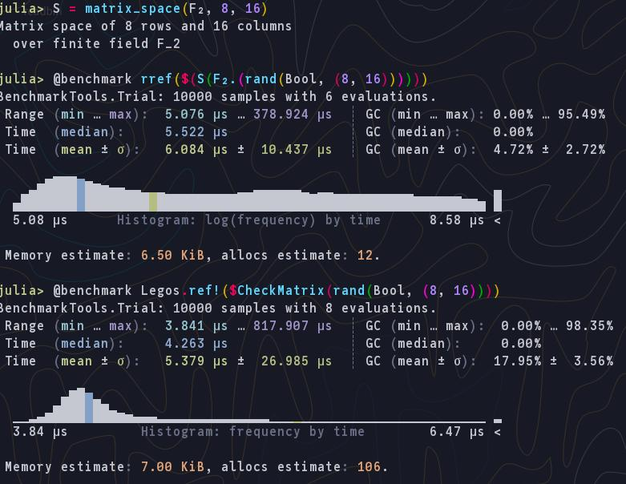
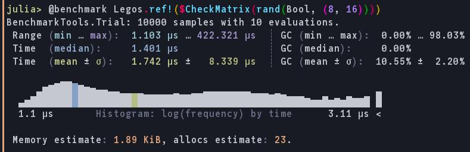

# QuantumLegos

<!--  -->

## How-Tos for Julia beginners
### How to get Julia
Download binary from https://julialang.org/downloads/.
Or use [juliaup](https://github.com/JuliaLang/juliaup)(recommended).

### How to run (for dev.)(init)
1. clone this repo
2. cd to here
3. `julia --project`
4. type `]` to enter Pkg mode in REPL.
5. `instantiate` to download all dependencies
6. press backspace to exit Pkg mode
7. `using Legos` to use (normally starts from here)

Recommended tools for REPL:
- OhMyREPL: for syntax highlight and interactive history search in REPL
- Revise: for auto-loading changes to the package

### How to build and browse docs locally(init)
1. cd to `docs/`
2. `julia --project`
3. `]` to enter Pkg mode
5. `Pkg> dev ..` to add `Legos` to available package
4. `Pkg> instantiate`
6. Exit Pkg mode(backspace) and `include("make.jl")` to build. Now you can exit julia REPL by `exit()` or `Ctrl-D`.
7. Alternatively, run `julia --project make.jl` from any shell.
8. To browse file on browser, I recommend either to use LiveServer.jl (from Pkg mode REPL, `add LiveServer`) and `julia -e 'using LiveServer; serve(dir="docs/build")'` or cd to `docs/build` and `python -m http.server --bind localhost`. Details on [Note on Documenter.jl docs](https://documenter.juliadocs.org/stable/man/guide/#Building-an-Empty-Document)

- You can stop the local server by just stopping LiveServer or python http.server (just `Ctrl-C`)
- You can update the docs by `julia --project make.jl` on `docs/` and reload on your browser.

## TODO
- [x] write test for CheckMatrix constructor
  - [x] add `Base.==` method for CheckMatrix
- [x] implement checkmatrix constructor from stabilizer generator
- [x] implement constructor for State
  - [x] implement initial constructor for State with only 1 lego and 0 edge
  - [x] implement action function on State
    - [x] implement tracing function for CheckMatrix
      - [ ] test for self-tracing
    - [x] implement map function from LegoLeg to checkmatrix index
- [x] implement functions to glean stabilizer generator from CheckMatrix
- [ ] test functions with examples on the paper
- [x] improve perf of ref!
- [ ] implement function to calculate enumerator polynomial

## ref! optimization
before

(so many allocs, take profile)

after

